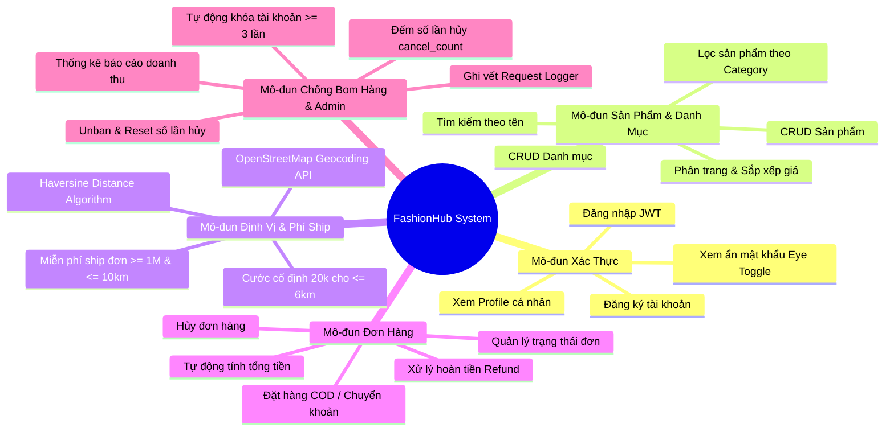
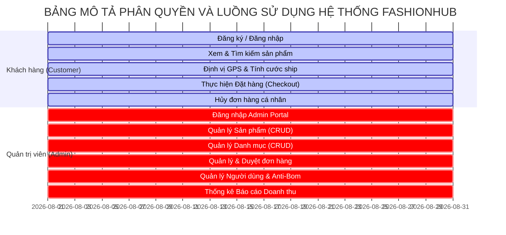
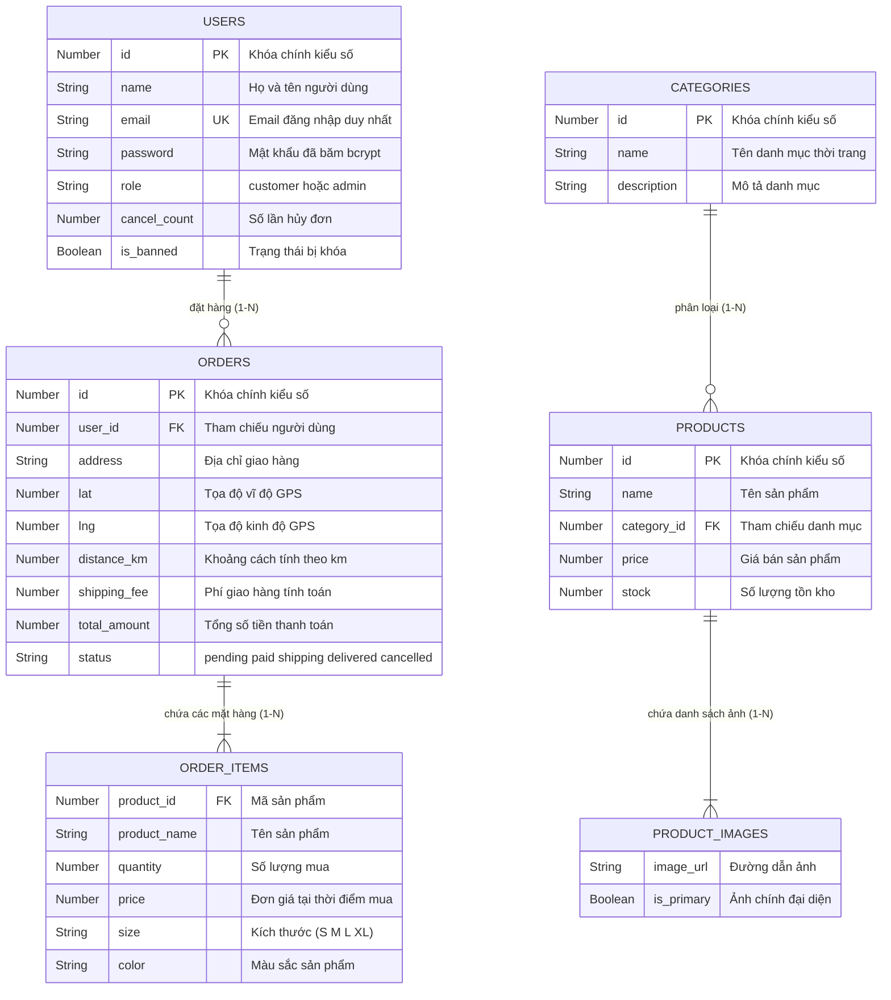
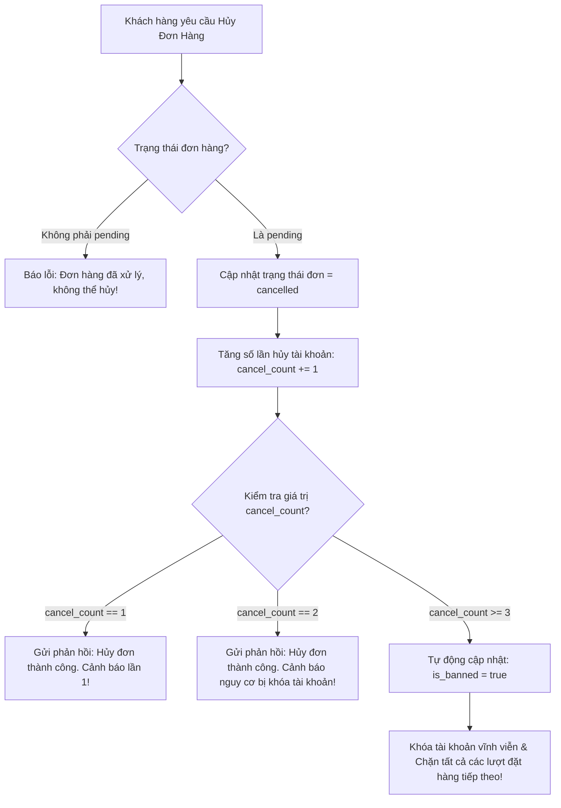

# BÁO CÁO TIỂU LUẬN / ĐỒ ÁN MÔN HỌC

**ĐỀ TÀI: NGIÊN CỨU, THIẾT KẾ VÀ XÂY DỰNG HỆ THỐNG QUẢN LÝ THƯƠNG MẠI ĐIỆN TỬ THỜI TRANG (FASHIONHUB) DỰA TRÊN RESTFUL API, NODEJS, EXPRESSJS, MONGODB VÀ REACTJS**

---

## MỤC LỤC

- [1. Danh mục hình ảnh, bảng biểu](#1-danh-mục-hình-ảnh-bảng-biểu)
- [2. Mở đầu](#2-mở-đầu)
  - [Lý do chọn đề tài](#lý-do-chọn-đề-tài)
  - [Mục tiêu nghiên cứu](#mục-tiêu-nghiên-cứu)
  - [Phạm vi thực hiện](#phạm-vi-thực-hiện)
  - [Phương pháp thực hiện](#phương-pháp-thực-hiện)
  - [Cấu trúc báo cáo](#cấu-trúc-báo-cáo)
- [CHƯƠNG 1. TỔNG QUAN ĐỀ TÀI](#chương-1-tổng-quan-đề-tài)
  - [1.1. Giới thiệu bài toán](#11-giới-thiệu-bài-toán)
  - [1.2. Đối tượng sử dụng](#12-đối-tượng-sử-dụng)
  - [1.3. Các chức năng chính](#13-các-chức-năng-chính)
  - [1.4. Khảo sát các hệ thống tương tự](#14-khảo-sát-các-hệ-thống-tương-tự)
- [CHƯƠNG 2. CƠ SỞ LÝ THUYẾT](#chương-2-cơ-sở-lý-thuyết)
  - [2.1. Kiến trúc Client-Server và RESTful API Standard](#21-kiến-trúc-client-server-và-restful-api-standard)
  - [2.2. Môi trường Node.js và Framework Express.js](#22-môi-trường-nodejs-và-framework-expressjs)
  - [2.3. Cơ sở dữ liệu NoSQL MongoDB và Mongoose ODM](#23-cơ-sở-dữ-liệu-nosql-mongodb-và-mongoose-odm)
  - [2.4. Công nghệ Xác thực (JWT & Bcryptjs)](#24-công-nghệ-xác-thực-jwt--bcryptjs)
  - [2.5. Tích hợp Dịch vụ Địa lý (OpenStreetMap Nominatim Geocoding API)](#25-tích-hợp-dịch-vụ-địa-lý-openstreetmap-nominatim-geocoding-api)
  - [2.6. Thư viện Giao diện Frontend ReactJS 18 & Axios Interceptors](#26-thư-viện-giao-diện-frontend-reactjs-18--axios-interceptors)
- [CHƯƠNG 3. PHÂN TÍCH VÀ THIẾT KẾ HỆ THỐNG](#chương-3-phân-tích-và-thiết-kế-hệ-thống)
  - [3.1. Phân tích Yêu cầu Chức năng (Functional Requirements)](#31-phân-tích-yêu-cầu-chức-năng-functional-requirements)
  - [3.2. Phân tích Yêu cầu Phi Chức năng (Non-Functional Requirements)](#32-phân-tích-yêu-cầu-phi-chức-năng-non-functional-requirements)
  - [3.3. Sơ đồ Use Case (Use Case Diagram)](#33-sơ-đồ-use-case-use-case-diagram)
  - [3.4. Thiết kế Cơ sở Dữ liệu (ERD Diagram & Schemas)](#34-thiết-kế-cơ-sở-dữ-liệu-erd-diagram--schemas)
  - [3.5. Thiết kế Kiến trúc Hệ thống (System Architecture Diagram)](#35-thiết-kế-kiến-trúc-hệ-thống-system-architecture-diagram)
- [CHƯƠNG 4. XÂY DỰNG HỆ THỐNG](#chương-4-xây-dựng-hệ-thống)
  - [4.1. Kiến trúc chương trình (`app.js` và `server.js`)](#41-kiến-trúc-chương-trình-appjs-và-serverjs)
  - [4.2. Cấu trúc thư mục mã nguồn](#42-cấu-trúc-thư-mục-mã-nguồn)
  - [4.3. Mô tả các chức năng đã triển khai](#43-mô-tả-các-chức-năng-đã-triển-khai)
    - [Mô-đun 1: Xác thực & Quản lý Người dùng](#mô-đun-1-xác-thực--quản-lý-người-dùng)
    - [Mô-đun 2: Quản lý Danh mục & Sản phẩm](#mô-đun-2-quản-lý-danh-mục--sản-phẩm)
    - [Mô-đun 3: Tích hợp Bản đồ GPS & Thuật toán Phí giao hàng](#mô-đun-3-tích-hợp-bản-đồ-gps--thuật-toán-phí-giao-hàng)
    - [Mô-đun 4: Xử lý Đơn hàng & Thuật toán Chống Bom Hàng](#mô-đun-4-xử-lý-đơn-hàng--thuật-toán-chống-bom-hàng)
    - [Mô-đun 5: Hệ thống 4 Middlewares Bảo mật](#mô-đun-5-hệ-thống-4-middlewares-bảo-mật)
  - [4.4. Giao diện Người dùng và Kết quả Thực nghiệm](#44-giao-diện-người-dùng-và-kết-quả-thực-nghiệm)
- [CHƯƠNG 5. KIỂM THỬ VÀ ĐÁNH GIÁ](#chương-5-kiểm-thử-và-đánh-giá)
  - [5.1. Kiểm thử các chức năng (Test Cases)](#51-kiểm-thử-các-chức-năng-test-cases)
  - [5.2. Kết quả đạt được](#52-kết-quả-đạt-được)
  - [5.3. Các hạn chế tồn tại](#53-các-hạn-chế-tồn-tại)
  - [5.4. Hướng cải thiện](#54-hướng-cải-thiện)
- [KẾT LUẬN](#kết-luận)
  - [Tổng kết kết quả](#tổng-kết-kết-quả)
  - [Kiến thức đạt được](#kiến-thức-đạt-được)
  - [Hạn chế của đồ án](#hạn-chế-của-đồ-án)
  - [Hướng phát triển trong tương lai](#hướng-phát-triển-trong-tương-lai)
- [TÀI LIỆU THAM KHẢO](#tài-liệu-tham-khảo)
- [PHỤ LỤC](#phụ-lục)
  - [Phụ lục A: Hướng dẫn Cài đặt & Vận hành Chi tiết](#phụ-lục-a-hướng-dẫn-cài-đặt--vận-hành-chi-tiết)
  - [Phụ lục B: Collection API Postman / Thunder Client](#phụ-lục-b-collection-api-postman--thunder-client)

---

## 1. DANH MỤC HÌNH ẢNH, BẢNG BIỂU

### Danh mục Hình ảnh (Diagrams & Flowcharts)
* **Hình 1.1**: Mô hình Tổng quan Kiến trúc Client-Server RESTful API trong FashionHub.
* **Hình 3.1**: Sơ đồ Use Case tổng thể cho Người dùng (Khách hàng & Admin).
* **Hình 3.2**: Sơ đồ Quan hệ Dữ liệu NoSQL (ERD Mermaid Diagram) của các Collection.
* **Hình 3.3**: Sơ đồ Luồng Luồng xử lý Định vị GPS OpenStreetMap và Thuật toán Haversine.
* **Hình 4.1**: Sơ đồ Kiến trúc Phân tách Trách nhiệm giữa `app.js` và `server.js`.
* **Hình 4.2**: Sơ đồ Luồng Thuật toán Chống Bom hàng (Anti-Order Banning Flow).

### Danh mục Bảng biểu (Tables)
* **Bảng 1.1**: Bảng so sánh đặc tính FashionHub với các hệ thống e-commerce thương mại hiện nay.
* **Bảng 3.1**: Bảng Ma trận Yêu cầu Chức năng (Functional Requirement Matrix).
* **Bảng 3.2**: Bảng Cấu trúc Schema Người dùng (`users` Collection).
* **Bảng 3.3**: Bảng Cấu trúc Schema Danh mục (`categories` Collection).
* **Bảng 3.4**: Bảng Cấu trúc Schema Sản phẩm (`products` Collection).
* **Bảng 3.5**: Bảng Cấu trúc Schema Đơn hàng (`orders` Collection).
* **Bảng 4.1**: Danh mục đầy đủ 23 Endpoints RESTful API của hệ thống FashionHub.
* **Bảng 4.2**: Danh mục Các Mã trạng thái HTTP Response được chuẩn hóa.
* **Bảng 5.1**: Bảng Kế hoạch Kịch bản Kiểm thử Chức năng (System Integration Test Plan).

---

## 2. MỞ ĐẦU

### Lý do chọn đề tài
Trong thế giới công nghệ số hiện đại, Thương mại Điện tử (E-Commerce) đã trở thành một phần không thể thiếu của nền kinh tế toàn cầu. Đặc biệt trong ngành hàng Thời trang (Fashion), các tiêu chuẩn của người tiêu dùng ngày càng nâng cao: từ tốc độ truy cập trang web, tính trực quan của sản phẩm, tính chính xác của địa chỉ giao hàng cho đến sự minh bạch về cước phí vận chuyển.

Từ góc độ kỹ thuật phần mềm, việc xây dựng một hệ thống backend thương mại điện tử hiện đại đòi hỏi khả năng xử lý bất đồng bộ cao, kiến trúc dữ liệu NoSQL linh hoạt, bảo mật xác thực người dùng và khả năng tích hợp mở rộng với các dịch vụ vị trí bản đồ địa lý bên ngoài (Geocoding External APIs). 

Nhận thấy tính thực tiễn cao và vai trò quan trọng của việc làm chủ công nghệ backend, đề tài **"Nghiên cứu, Thiết kế và Xây dựng Hệ thống Quản lý Thương mại Điện tử Thời trang (FashionHub)"** được lựa chọn nghiên cứu nhằm hiện thực hóa một hệ thống hoàn chỉnh từ RESTful API Node.js/Express.js, CSDL MongoDB/Mongoose đến giao diện mua sắm ReactJS cao cấp.

### Mục tiêu nghiên cứu
1. **Về mặt Lý thuyết**:
   - Nắm vững nguyên lý thiết kế hệ thống RESTful API theo chuẩn REST.
   - Nghiên cứu cơ chế bất đồng bộ Event Loop của Node.js và Framework Express.js.
   - Làm chủ mô hình dữ liệu NoSQL trên CSDL MongoDB và thư viện ODM Mongoose.
   - Nghiên cứu các phương pháp bảo mật xác thực (JWT), mã hóa mật khẩu (`bcryptjs`) và giải thuật toán học định vị Haversine.

2. **Về mặt Thực tiễn**:
   - Xây dựng hoàn chỉnh hệ thống RESTful API với 23 endpoints chuẩn mực.
   - Phát triển cơ chế tự động Fallback sang Embedded Memory Database (`MongoMemoryServer`) và cơ chế tự động nạp dữ liệu seed (`Auto-Seeding`) khi ứng dụng khởi chạy lần đầu.
   - Tích hợp dịch vụ định vị tọa độ GPS thực tế **OpenStreetMap Nominatim API** để tự động tính khoảng cách và áp cước phí giao hàng linh hoạt.
   - Triển khai thuật toán kiểm soát người dùng bom hàng (Anti-Order Banning System).
   - Thiết kế giao diện Frontend ReactJS hiện đại với phông chữ chuẩn tiếng Việt `Be Vietnam Pro`, nút Mắt 👁️ ẩn/hiện mật khẩu và các huy hiệu cước phí sang trọng.

### Phạm vi thực hiện
- **Phạm vi Chức năng**: Quản lý Xác thực (Đăng ký, Đăng nhập, Profile), Quản lý Sản phẩm, Quản lý Danh mục, Định vị Bản đồ & Tính cước ship, Đặt hàng & Hủy đơn, Quản lý Người dùng & Khóa tài khoản, Báo cáo Thống kê Doanh thu.
- **Phạm vi Công nghệ**: Node.js (v18+), Express.js (v4.18), MongoDB / Mongoose (v8+), ReactJS 18, OpenStreetMap Geocoding API.
- **Phạm vi Thử nghiệm**: Chạy thử nghiệm thực tế trên môi trường Localhost (Backend: Port 5000, Frontend: Port 3000) và kiểm thử API tự động qua Postman / Thunder Client Collection.

### Phương pháp thực hiện
- **Phương pháp Nghiên cứu Tài liệu**: Nghiên cứu tài liệu chính thức (Official Documentation) của Node.js, Express.js, MongoDB, Mongoose, ReactJS, JWT, OpenStreetMap Nominatim.
- **Phương pháp Phân tích & Thiết kế Phần mềm**: Áp dụng mô hình MVC, vẽ sơ đồ Use Case, ERD (Entity Relationship Diagram) bằng ngôn ngữ Mermaid, ma trận chức năng.
- **Phương pháp Thực nghiệm Phần mềm**: Tiến hành lập trình mã nguồn, refactor tối ưu hóa kiến trúc (`app.js` + `server.js`), sửa lỗi trải nghiệm người dùng (như lỗi reload 401, lỗi vỡ chữ cước ship).
- **Phương pháp Kiểm thử**: Tiến hành kiểm thử hộp đen (Black-box Testing), kiểm thử API tích hợp (API Integration Testing) và đánh giá hiệu năng.

### Cấu trúc báo cáo
Báo cáo tiểu luận được chia thành **5 Chương chính**, cùng phần **Mở đầu**, **Kết luận**, **Tài liệu tham khảo** và **Phụ lục**:
- **Mở đầu**: Nêu lý do chọn đề tài, mục tiêu, phạm vi, phương pháp và cấu trúc báo cáo.
- **Chương 1. Tổng quan đề tài**: Giới thiệu bài toán, đối tượng sử dụng, các chức năng chính và khảo sát các hệ thống e-commerce thực tế.
- **Chương 2. Cơ sở lý thuyết**: Trình bày nền tảng lý thuyết của Node.js, Express.js, MongoDB, Mongoose, RESTful API, JWT, OpenStreetMap API và ReactJS.
- **Chương 3. Phân tích và thiết kế hệ thống**: Phân tích yêu cầu chức năng/phi chức năng, Use Case Diagram, sơ đồ ERD dữ liệu và kiến trúc MVC.
- **Chương 4. Xây dựng hệ thống**: Mô tả cấu trúc thư mục, chi tiết cài đặt mã nguồn các mô-đun nghiệp vụ, 4 Middlewares bảo mật và giao diện kết quả.
- **Chương 5. Kiểm thử và đánh giá**: Bảng Test Cases chi tiết, kết quả đạt được, hạn chế và hướng cải thiện.
- **Kết luận & Tài liệu tham khảo & Phụ lục**: Tổng kết kết quả đồ án, danh mục tài liệu tham khảo và phụ lục mã nguồn/hướng dẫn vận hành.

---

## CHƯƠNG 1. TỔNG QUAN ĐỀ TÀI

### 1.1. Giới thiệu bài toán
Thời trang là ngành hàng mang tính định hình phong cách cá nhân cao, đòi hỏi các trang web bán hàng không chỉ có giao diện đẹp mắt mà hệ thống quản lý đơn hàng phía sau phải vận hành chính xác. Bài toán đặt ra cho hệ thống **FashionHub** là xây dựng một nền tảng Thương mại Điện tử đáp ứng đầy đủ các tiêu chuẩn kỹ thuật:
1. Cho phép người mua hàng dễ dàng xem danh sách sản phẩm, lọc theo loại trang phục (Áo, Quần, Váy, Phụ kiện), tìm kiếm theo từ khóa và xem chi tiết kích thước/màu sắc.
2. Cho phép người mua nhập địa chỉ nhận hàng và hệ thống tự động xác định vị trí địa lý trên bản đồ GPS thực tế để tính toán chính xác khoảng cách vận chuyển và số tiền phí giao hàng.
3. Cho phép ban quản trị (Admin) kiểm soát toàn bộ kho hàng, quản lý đơn hàng, theo dõi doanh thu và phát hiện các tài khoản nghi ngờ bom hàng để tiến hành xử lý kịp thời.

### 1.2. Đối tượng sử dụng
Hệ thống được thiết kế dành cho **2 nhóm đối tượng người dùng chính**:

1. **Khách hàng Mua sắm (Customer)**:
   - Là người tiêu dùng có nhu cầu tìm kiếm và mua sắm sản phẩm thời trang trực tuyến.
   - Có thể đăng ký tài khoản mới, đăng nhập an toàn, quản lý thông tin cá nhân.
   - Tìm kiếm sản phẩm, xem chi tiết, thêm sản phẩm vào giỏ hàng.
   - Thực hiện quy trình Thanh toán (Checkout), nhập địa chỉ để định vị tọa độ GPS tự động và nhận cước phí giao hàng minh bạch.
   - Xem lịch sử đơn hàng cá nhân, thực hiện yêu cầu hủy đơn hàng khi chưa chuyển hàng.

2. **Quản trị viên Hệ thống (Admin)**:
   - Là chủ cửa hàng hoặc nhân viên quản lý vận hành hệ thống.
   - Đăng nhập quyền quản trị độc lập tại trang `/admin-login`.
   - Quản lý toàn bộ danh mục sản phẩm (Thêm, Sửa, Xóa, Phân loại).
   - Quản lý kho sản phẩm, cập nhật số lượng tồn kho và mức giá.
   - Quản lý toàn bộ đơn hàng khách hàng, cập nhật trạng thái đơn (`pending` $\rightarrow$ `confirmed` $\rightarrow$ `shipping` $\rightarrow$ `delivered`), xử lý hoàn tiền đơn hủy.
   - Quản lý danh sách người dùng, xem danh sách tài khoản nghi ngờ bom hàng và thực hiện khóa vĩnh viễn (`is_banned = true`) hoặc mở khóa (`unban`).
   - Theo dõi báo cáo thống kê tổng doanh thu, số lượng đơn hàng và số liệu tăng trưởng.

### 1.3. Các chức năng chính



### 1.4. Khảo sát các hệ thống tương tự
Dưới đây là bảng khảo sát so sánh đặc tính kỹ thuật giữa **FashionHub** và các mô hình e-commerce hiện nay:

#### Bảng 1.1: Bảng so sánh đặc tính hệ thống
| Tiêu chí so sánh | Hệ thống E-Commerce Truyền thống | Shopee / Lazada (Thương mại lớn) | Hệ thống FashionHub |
| :--- | :--- | :--- | :--- |
| **Kiến trúc dữ liệu** | CSDL Quan hệ SQL cố định | Microservices + Multi-DB | MongoDB NoSQL (Flexibility) |
| **Tự động chạy CSDL** | Cần cài đặt SQL Server / MySQL | Cấu hình Server phức tạp | **Auto Fallback MongoMemoryServer** |
| **Tính phí vận chuyển** | Phí cố định hoặc nhập tay | Đơn vị vận chuyển thứ ba | **Tích hợp OpenStreetMap GPS Auto** |
| **Bảo vệ chống hủy đơn** | Không có hoặc thủ công | Khóa tài khoản qua điểm tín nhiệm | **Thuật toán Anti-Order Banning tự động** |
| **Xác thực API** | Session / Cookie truyền thống | OAuth 2.0 / JWT | **JWT Token chuẩn RESTful** |
| **Cài đặt ban đầu** | Thủ công phức tạp | Cần quy trình CI/CD | **Auto-Seeding data ngay khi bật** |

---

## CHƯƠNG 2. CƠ SỞ LÝ THUYẾT

### 2.1. Kiến trúc Client-Server và RESTful API Standard
Kiến trúc Client-Server là mô hình phân tán trong đó trách nhiệm xử lý được chia làm hai thành phần chính:
- **Client (Phía khách)**: Đảm nhận việc hiển thị giao diện, tiếp nhận tương tác người dùng và gửi các yêu cầu (HTTP Requests) tới Server.
- **Server (Phía máy chủ)**: Đảm nhận nhận yêu cầu, thực thi logic nghiệp vụ, truy vấn CSDL và trả về kết quả dưới dạng dữ liệu thô JSON (JavaScript Object Notation).

**REST (Representational State Transfer)** là một kiểu kiến trúc phần mềm định nghĩa các quy tắc thiết kế Web API. Một hệ thống API chuẩn RESTful cần đạt các nguyên tắc:
1. **Stateless (Không lưu trạng thái)**: Mỗi HTTP Request từ Client lên Server phải chứa đầy đủ thông tin để Server hiểu và xử lý. Server không lưu thông tin phiên làm việc (Session) của Client trong bộ nhớ.
2. **Uniform Interface (Giao diện thống nhất)**: Tài nguyên được định danh rõ ràng qua URL (VD: `/api/products`, `/api/orders`), sử dụng chuẩn các phương thức HTTP Verbs:
   - `GET`: Đọc tài nguyên.
   - `POST`: Tạo tài nguyên mới.
   - `PUT`: Cập nhật tài nguyên.
   - `DELETE`: Xóa tài nguyên.
3. **Mã phản hồi chuẩn (Standard Status Codes)**: Sử dụng các mã trả về chuẩn HTTP như `200 OK`, `201 Created`, `400 Bad Request`, `401 Unauthorized`, `403 Forbidden`, `404 Not Found`, `409 Conflict`, `500 Internal Error`.

### 2.2. Môi trường Node.js và Framework Express.js
- **Node.js**: Là một môi trường thực thi JavaScript (JavaScript Runtime Environment) xây dựng trên bộ công cụ V8 JavaScript Engine của Google Chrome. Node.js hoạt động dựa trên mô hình **Single-threaded Event Loop** bất đồng bộ (Non-blocking I/O), cho phép ứng dụng xử lý hàng nghìn kết nối đồng thời với hiệu năng cực cao mà không bị tắc nghẽn bộ nhớ.
- **Express.js**: Là framework web tối giản (minimalist) và linh hoạt phổ biến nhất trên Node.js. Express cung cấp hệ thống định tuyến (Routing) mạnh mẽ và cơ chế **Middleware** cho phép can thiệp xử lý dữ liệu trước khi đến Controller.

### 2.3. Cơ sở dữ liệu NoSQL MongoDB và Mongoose ODM
- **MongoDB**: Là hệ quản trị cơ sở dữ liệu NoSQL hướng tài liệu (Document-oriented Database) hàng đầu thế giới. Dữ liệu trong MongoDB được lưu trữ dưới dạng các tài liệu BSON (Binary JSON), cho phép lưu trữ mảng, đối tượng lồng nhau mà không cần ràng buộc lược đồ cứng nhắc như SQL.
- **Mongoose ODM**: Là thư viện Object Data Modeling (ODM) dành cho Node.js và MongoDB. Mongoose giúp định nghĩa lược đồ (`Schema`), khởi tạo Mô hình (`Model`), thực hiện xác thực dữ liệu (`Validation`), quản lý quan hệ và cung cấp các hàm truy vấn mạnh mẽ (`findOne`, `findByIdAndUpdate`, `aggregate`).
- **MongoMemoryServer**: Là thư viện hỗ trợ chạy dịch vụ MongoDB nhúng trực tiếp trong bộ nhớ RAM của ứng dụng Node.js. Thư viện này giúp dự án có thể tự khởi động và chạy hoàn chỉnh dữ liệu ngay lập tức trên các máy tính chưa cài đặt sẵn MongoDB.

### 2.4. Công nghệ Xác thực (JWT & Bcryptjs)
- **JSON Web Token (JWT)**: Là chuẩn mở (RFC 7519) định nghĩa phương thức truyền tải thông tin an toàn giữa các bên dưới dạng đối tượng JSON. Cấu trúc JWT bao gồm 3 phần ngăn cách bởi dấu chấm: `Header.Payload.Signature`.
  - Khi người dùng đăng nhập thành công, Server tạo chữ ký bí mật (`process.env.JWT_SECRET`) mã hóa thông tin `id`, `email`, `role` thành một chuỗi Token gửi về Client.
  - Client lưu Token vào `localStorage` và tự động gắn vào Header `Authorization: Bearer <token>` ở mỗi request tiếp theo.
- **Bcryptjs**: Là thư viện mã hóa mật khẩu một chiều áp dụng giải thuật băm **Blowfish**. Bcrypt tích hợp kỹ thuật thêm muối (`Salting`) tự động, chống lại các đòn tấn công từ điển (Dictionary Attack) và bảng cầu vồng (Rainbow Table). Mật khẩu gốc người dùng được băm thành chuỗi 60 ký tự (VD: `$2a$10$...`) trước khi lưu vào MongoDB.

### 2.5. Tích hợp Dịch vụ Địa lý (OpenStreetMap Nominatim Geocoding API)
**Geocoding** là quá trình chuyển đổi văn bản địa chỉ mô tả (VD: *"10 Nguyễn Văn Công, Phường 3, Gò Vấp, TP.HCM"*) thành tọa độ địa lý cặp Vĩ độ/Kinh độ (`latitude`/`longitude`).

Dự án tích hợp dịch vụ **OpenStreetMap Nominatim API** (dịch vụ bản đồ mở miễn phí chuẩn quốc tế). Dịch vụ tiếp nhận chuỗi địa chỉ từ request, tìm kiếm dữ liệu địa lý toàn cầu và trả về cấu trúc JSON chứa tọa độ `lat`, `lon` và `display_name`.

Sau khi thu được tọa độ GPS, hệ thống áp dụng **Công thức toán học Haversine** để tính khoảng cách đường cong mặt cầu Trái Đất từ vị trí kho hàng trung tâm (`STORE_LOCATION`: 10.7721, 106.6983) tới địa chỉ giao hàng:

$$\Delta lat = (lat_2 - lat_1) \cdot \frac{\pi}{180}, \quad \Delta lon = (lon_2 - lon_1) \cdot \frac{\pi}{180}$$

$$a = \sin^2\left(\frac{\Delta lat}{2}\right) + \cos\left(lat_1 \cdot \frac{\pi}{180}\right) \cdot \cos\left(lat_2 \cdot \frac{\pi}{180}\right) \cdot \sin^2\left(\frac{\Delta lon}{2}\right)$$

$$c = 2 \cdot \text{atan2}(\sqrt{a}, \sqrt{1-a})$$

$$d = R \cdot c \quad (với \ R = 6371 \text{ km})$$

### 2.6. Thư viện Giao diện Frontend ReactJS 18 & Axios Interceptors
- **ReactJS 18**: Thư viện JavaScript mã nguồn mở được phát triển bởi Meta dành cho việc xây dựng giao diện người dùng Single Page Application (SPA). React quản lý giao diện dựa trên **Virtual DOM**, hỗ trợ cơ chế render cực nhanh và quản lý trạng thái bằng **Hooks** (`useState`, `useEffect`, `useContext`).
- **Axios & Interceptors**: Axios là thư viện HTTP Client dựa trên Promise. Việc cấu hình `Axios Interceptor` cho phép tự động bắt các response trả về từ Server. Nếu mã lỗi là `401 Unauthorized` trên các trang bảo vệ, bộ chặn tự động loại bỏ Token hết hạn. Đối với trang Đăng nhập `/auth/login`, bộ chặn giữ nguyên luồng lỗi để hiển thị khung thông báo đỏ cho người dùng mà không bị reload lại trang.

---

## CHƯƠNG 3. PHÂN TÍCH VÀ THIẾT KẾ HỆ THỐNG

### 3.1. Phân tích Yêu cầu Chức năng (Functional Requirements)

#### Bảng 3.1: Bảng Ma trận Yêu cầu Chức năng Hệ thống
| Mã YC | Tên Yêu cầu Chức năng | Phân loại Người dùng | Mô tả chi tiết xử lý |
| :--- | :--- | :--- | :--- |
| **FR-01** | Đăng ký tài khoản | Khách vô danh | Nhập Họ tên, Email, SĐT, Mật khẩu. Mã hóa mật khẩu bcrypt, kiểm tra trùng lặp email/SĐT. |
| **FR-02** | Đăng nhập hệ thống | Khách hàng / Admin | Xác thực Email & Mật khẩu. Trả về Token JWT và thông tin User. Phân biệt quyền Admin/Customer. |
| **FR-03** | Xem & Lọc Sản phẩm | Tất cả người dùng | Hiển thị danh sách sản phẩm, lọc theo Danh mục, tìm theo Tên, sắp xếp Giá tăng/giảm, Phân trang. |
| **FR-04** | Định vị GPS & Phí ship | Khách hàng | Gửi địa chỉ lên OSM API, lấy tọa độ GPS, tính khoảng cách Haversine và áp cước phí giao hàng. |
| **FR-05** | Đặt hàng (Checkout) | Khách hàng đã login | Lưu đơn hàng vào MongoDB, lưu vị trí GPS, phí ship, tạo danh sách các mặt hàng mua. |
| **FR-06** | Hủy đơn & Chống bom | Khách hàng | Hủy đơn `pending`. Tăng `cancel_count += 1`. Nếu `cancel_count >= 3` tự động khóa tài khoản vĩnh viễn. |
| **FR-07** | Quản lý Sản phẩm | Quản trị viên (Admin) | Thêm sản phẩm mới, Cập nhật thông tin/giá/kho/ảnh, Xóa sản phẩm theo ID. |
| **FR-08** | Quản lý Danh mục | Quản trị viên (Admin) | Thêm, Sửa, Xóa các danh mục thời trang. |
| **FR-09** | Quản lý Đơn hàng | Quản trị viên (Admin) | Xem tất cả đơn hàng, chuyển trạng thái đơn (`pending` $\rightarrow$ `confirmed` $\rightarrow$ `shipping` $\rightarrow$ `delivered`), duyệt hoàn tiền. |
| **FR-10** | Quản lý Người dùng | Quản trị viên (Admin) | Xem danh sách user, lọc user nghi ngờ bom hàng, Khóa/Mở khóa tài khoản (`ban`/`unban`), đổi quyền role. |
| **FR-11** | Báo cáo Thống kê | Quản trị viên (Admin) | Thống kê tổng doanh thu, tổng số đơn hàng, phân tích trạng thái đơn. |

### 3.2. Phân tích Yêu cầu Phi Chức năng (Non-Functional Requirements)
1. **Hiệu năng & Tốc độ phản hồi (Performance)**:
   - Tốc độ phản hồi API trung bình dưới $100$ ms đối với các truy vấn CSDL.
   - Thời gian xử lý định vị Geocoding OSM API từ 200 - 800 ms (có cơ chế fallback timeout 4000 ms).
2. **An toàn & Bảo mật (Security)**:
   - Mật khẩu phải được mã hóa một chiều bằng `bcryptjs` với độ muối (Salt rounds) là 10.
   - Sử dụng chuẩn Token JWT có thời hạn hết hạn (`7d`), mã hóa thông tin phân quyền.
   - Chống tấn công Injection bằng cách áp dụng Mongoose Schema Validation nghiêm ngặt.
   - Cấu hình CORS giới hạn truy cập domain được phép.
3. **Tính Thuận tiện & Trải nghiệm Người dùng (Usability & UX)**:
   - Giao diện thiết kế theo phông chữ chuẩn tiếng Việt `Be Vietnam Pro`, màu sắc hài hòa, phản hồi hiệu ứng tức thì.
   - Tích hợp nút mắt 👁️ ẩn/hiện mật khẩu tránh nhập sai.
   - Hiển thị cước phí giao hàng dưới dạng huy hiệu nhãn màu xanh ngọc (`Emerald Gradient Pill Tag`) kèm biểu tượng trực quan.
4. **Tính An tâm & Tin cậy (Reliability & Availability)**:
   - Hệ thống tự động chuyển sang `MongoMemoryServer` nếu không có MongoDB cài sẵn.
   - Tự động seeding nạp 27 sản phẩm, 5 danh mục, 2 user ban đầu để hệ thống sẵn sàng hoạt động 100%.

### 3.3. Sơ đồ Use Case (Use Case Diagram)



### 3.4. Thiết kế Cơ sở Dữ liệu (ERD Diagram & Schemas)

#### Sơ đồ Quan hệ Dữ liệu NoSQL (ERD Mermaid Diagram)



#### Chi tiết cấu trúc các Bảng dữ liệu (Schemas)

##### Bảng 3.2: Structure of `users` Collection
| Tên trường (Field) | Kiểu dữ liệu | Ràng buộc (Constraints) | Ý nghĩa nghiệp vụ |
| :--- | :--- | :--- | :--- |
| `_id` | ObjectId | Primary Key (Default) | Mã định danh nội bộ MongoDB |
| `id` | Number | Required, Unique, Index | Khóa chính ID dạng số nguyên cho Frontend |
| `name` | String | Required, Trim | Họ và tên người dùng |
| `email` | String | Required, Unique, Lowercase | Địa chỉ Email đăng nhập duy nhất |
| `password` | String | Required | Chuỗi mật khẩu băm Blowfish `bcryptjs` |
| `role` | String | Enum: `['customer', 'admin']` | Vai trò quyền hạn trong hệ thống |
| `cancel_count` | Number | Default: `0` | Số lần đã hủy đơn hàng (Phục vụ Anti-bom) |
| `phone` | String | Default: `null` | Số điện thoại liên hệ |
| `is_banned` | Boolean | Default: `false` | Trạng thái tài khoản (`true` = bị khóa vĩnh viễn) |
| `created_at` | Date | Default: `Date.now` | Ngày giờ tạo tài khoản |

##### Bảng 3.3: Structure of `categories` Collection
| Tên trường (Field) | Kiểu dữ liệu | Ràng buộc (Constraints) | Ý nghĩa nghiệp vụ |
| :--- | :--- | :--- | :--- |
| `_id` | ObjectId | Primary Key (Default) | Mã định danh nội bộ MongoDB |
| `id` | Number | Required, Unique, Index | Khóa chính ID dạng số nguyên |
| `name` | String | Required, Trim | Tên danh mục (VD: Áo Nam, Quần Nữ...) |
| `description` | String | Default: `''` | Mô tả chi tiết loại danh mục |
| `created_at` | Date | Default: `Date.now` | Ngày giờ khởi tạo danh mục |

##### Bảng 3.4: Structure of `products` Collection
| Tên trường (Field) | Kiểu dữ liệu | Ràng buộc (Constraints) | Ý nghĩa nghiệp vụ |
| :--- | :--- | :--- | :--- |
| `_id` | ObjectId | Primary Key (Default) | Mã định danh nội bộ MongoDB |
| `id` | Number | Required, Unique, Index | Khóa chính ID dạng số nguyên |
| `name` | String | Required, Trim | Tên gọi sản phẩm thời trang |
| `category_id` | Number | Default: `null`, Index | Mã ID danh mục phân loại |
| `price` | Number | Required, Min: 0 | Giá bán niêm yết hiện tại |
| `original_price` | Number | Default: `null` | Giá gốc trước khi giảm giá |
| `description` | String | Default: `''` | Bài viết mô tả thông số sản phẩm |
| `stock` | Number | Default: `0` | Số lượng sản phẩm còn trong kho |
| `images` | Array Sub-doc | Schema `ProductImage` | Danh sách mảng các đường dẫn ảnh |
| `created_at` | Date | Default: `Date.now` | Ngày tạo sản phẩm |

##### Bảng 3.5: Structure of `orders` Collection
| Tên trường (Field) | Kiểu dữ liệu | Ràng buộc (Constraints) | Ý nghĩa nghiệp vụ |
| :--- | :--- | :--- | :--- |
| `_id` | ObjectId | Primary Key (Default) | Mã định danh nội bộ MongoDB |
| `id` | Number | Required, Unique, Index | Khóa chính ID dạng số nguyên đơn hàng |
| `user_id` | Number | Required, Index | Mã ID người dùng đặt hàng |
| `fullname` | String | Required | Họ tên người nhận hàng |
| `phone` | String | Required | Số điện thoại nhận hàng |
| `address` | String | Required | Địa chỉ chi tiết nhận hàng |
| `note` | String | Default: `''` | Ghi chú của khách hàng khi đặt |
| `total_amount` | Number | Required | Tổng tiền đơn hàng (Đã cộng phí ship) |
| `shipping_fee` | Number | Default: `0` | Phí vận chuyển áp dụng |
| `lat` | Number | Default: `null` | Tọa độ GPS Vĩ độ lấy từ OpenStreetMap |
| `lng` | Number | Default: `null` | Tọa độ GPS Kinh độ lấy từ OpenStreetMap |
| `distance_km` | Number | Default: `null` | Khoảng cách tính theo km từ kho shop |
| `status` | String | Enum: `['pending', 'paid', 'confirmed', 'shipping', 'delivered', 'cancelled']` | Trạng thái tiến trình của đơn hàng |
| `cancel_reason` | String | Default: `null` | Lý do khách hủy đơn hàng |
| `refund_status` | String | Enum: `['none', 'requested', 'approved', 'rejected']` | Trạng thái xử lý hoàn tiền đơn hủy |
| `items` | Array Sub-doc | Schema `OrderItem` | Chi tiết danh sách sản phẩm mua trong đơn |

### 3.5. Thiết kế Kiến trúc Hệ thống (System Architecture Diagram)

```text
                                  +-------------------------------------------------------+
                                  |              FRONTEND CLIENT (ReactJS)                |
                                  |              Running on Port 3000                     |
                                  +---------------------------+---------------------------+
                                                              |
                                                    HTTP / HTTPS Requests
                                                    (JSON RESTful Payload)
                                                              |
                                                              v
+-------------------------------------------------------------------------------------------------------------------+
|                                            BACKEND SERVER (Node.js & Express.js)                                  |
|                                                    Running on Port 5000                                           |
|                                                                                                                   |
|   +-----------------------------------------------------------------------------------------------------------+   |
|   |                                          MIDDLEWARES LAYER                                                |   |
|   |  - requestLogger (Ghi vết truy cập IP/Status)        - cors (Cho phép Cross-Origin)                           |   |
|   |  - authenticate & isAdmin (Check JWT Token & Role)  - validator (Regex Input Sanitization)                  |   |
|   |  - errorHandler (Global Error Catching)             - utf8Charset (Hỗ trợ hiển thị tiếng Việt)                |   |
|   +---------------------------------------+-------------------------------------------------------------------+   |
|                                           |                                                                       |
|                                           v                                                                       |
|   +-----------------------------------------------------------------------------------------------------------+   |
|   |                                          CONTROLLERS LAYER                                                |   |
|   |  - authController.js       - productController.js      - categoryController.js                             |   |
|   |  - orderController.js      - userController.js                                                                |   |
|   +-------------------+---------------------------------------------------+-----------------------------------+   |
|                       |                                                   |                                       |
|      External HTTPS   |                                                   | Mongoose ODM                          |
|      Geocoding Call   |                                                   | Queries                               |
|                       v                                                   v                                       |
|   +-------------------------------+                   +-------------------------------------------------------+   |
|   |  OpenStreetMap Nominatim API  |                   |                   DATABASE LAYER                      |   |
|   |  (Convert Address -> GPS Lat/Lng)                 |  - Primary: Local MongoDB (Port 27017)                |   |
|   +-------------------------------+                   |  - Fallback: MongoMemoryServer (Embedded RAM DB)      |   |
|                                                       +-------------------------------------------------------+   |
+-------------------------------------------------------------------------------------------------------------------+
```

---

## CHƯƠNG 4. XÂY DỰNG HỆ THỐNG

### 4.1. Kiến trúc chương trình (`app.js` và `server.js`)

Để mã nguồn đạt tiêu chuẩn công nghiệp (Production-ready Architecture) và dễ dàng bảo trì:
- **[`src/app.js`](file:///c:/Users/PC/Downloads/fashionhub1/fashionhub/fashionhub/backend/src/app.js)**: Chịu trách nhiệm thiết lập ứng dụng Express, đăng ký Middlewares toàn cục (CORS, Request Logger, JSON Parser, Error Handler) và gắn tất cả các đường dẫn API Routes. File xuất bản đối tượng `app`.
- **[`src/server.js`](file:///c:/Users/PC/Downloads/fashionhub1/fashionhub/fashionhub/backend/src/server.js)**: Đảm nhận việc khởi tạo Server HTTP listening trên cổng `5000`, kích hoạt hàm kết nối CSDL MongoDB (`connectDB()`) và lắng nghe các sự kiện hệ thống.

```javascript
// src/server.js - Nội dung mã nguồn khởi tạo Server
require('dotenv').config();
const app = require('./app');
const connectDB = require('./config/database');

const PORT = process.env.PORT || 5000;

connectDB().then(() => {
  app.listen(PORT, () => {
    console.log(`Server chạy tại http://localhost:${PORT}`);
  });
}).catch(err => {
  console.error('Không thể kết nối CSDL:', err);
});
```

### 4.2. Cấu trúc thư mục mã nguồn

```text
fashionhub/
├── backend/
│   ├── src/
│   │   ├── config/
│   │   │   ├── database.js          # Kết nối CSDL & Auto-fallback MongoMemoryServer
│   │   │   └── seedData.js          # Khởi tạo 27 sản phẩm, 5 danh mục, 2 user, 2 đơn mẫu
│   │   ├── controllers/
│   │   │   ├── authController.js    # Đăng ký, Đăng nhập, Profile
│   │   │   ├── categoryController.js# CRUD Danh mục sản phẩm
│   │   │   ├── orderController.js   # Đặt hàng, Định vị GPS, Phí ship, Hủy đơn, Refund
│   │   │   ├── productController.js # CRUD Sản phẩm, Lọc, Phân trang, Tìm kiếm
│   │   │   └── userController.js    # Quản lý User, Anti-bom, Ban/Unban
│   │   ├── middlewares/
│   │   │   ├── auth.js              # Xác thực JWT & Phân quyền Admin
│   │   │   ├── errorHandler.js      # Bắt ngoại lệ tập trung Global Error
│   │   │   ├── logger.js            # Ghi vết Request Log
│   │   │   └── validator.js         # Validate định dạng Input Regex
│   │   ├── models/
│   │   │   ├── Category.js          # Schema Mongoose Danh mục
│   │   │   ├── Order.js             # Schema Mongoose Đơn hàng
│   │   │   ├── Product.js           # Schema Mongoose Sản phẩm & Ảnh
│   │   │   └── User.js              # Schema Mongoose Người dùng
│   │   ├── routes/
│   │   │   ├── auth.js              # Routes /api/auth
│   │   │   ├── categories.js        # Routes /api/categories
│   │   │   ├── orders.js            # Routes /api/orders
│   │   │   ├── products.js          # Routes /api/products
│   │   │   └── users.js             # Routes /api/users
│   │   ├── app.js                   # Cấu hình Express App
│   │   └── server.js                # Entrypoint chạy Server HTTP
│   ├── .env                         # Cấu hình biến môi trường
│   ├── FashionHub_API_Collection.json # File Collection kiểm thử API
│   └── package.json                 # Khai báo thư viện Backend
└── frontend/
    ├── src/
    │   ├── api/                     # Tầng gọi API Axios
    │   ├── components/              # UI Components dùng chung (Header, Footer, Nav)
    │   ├── context/                 # AuthContext & CartContext
    │   ├── pages/                   # Các trang giao diện SPA (Checkout, Login, Admin...)
    │   ├── index.css                # CSS Hệ thống & Google Fonts Be Vietnam Pro
    │   └── App.js                   # Client Routing & Protected Routes
```

### 4.3. Mô tả các chức năng đã triển khai

#### Danh mục 23 Endpoints RESTful API của Hệ thống
##### Bảng 4.1: Danh mục đầy đủ 23 Endpoints RESTful API
| STT | Phương thức | Đường dẫn Endpoint | Middleware bảo vệ | Chức năng nghiệp vụ |
| :--- | :--- | :--- | :--- | :--- |
| 1 | `POST` | `/api/auth/register` | `validateRegister` | Đăng ký tài khoản người dùng mới |
| 2 | `POST` | `/api/auth/login` | `validateLogin` | Đăng nhập & Trả về Token JWT |
| 3 | `GET` | `/api/auth/profile` | `authenticate` | Xem thông tin cá nhân tài khoản đăng nhập |
| 4 | `GET` | `/api/products` | None | Danh sách sản phẩm (Lọc, Tìm kiếm, Phân trang) |
| 5 | `GET` | `/api/products/:id` | None | Xem chi tiết 1 sản phẩm theo ID |
| 6 | `POST` | `/api/products` | `authenticate, isAdmin` | Tạo sản phẩm mới |
| 7 | `PUT` | `/api/products/:id` | `authenticate, isAdmin` | Cập nhật sản phẩm theo ID |
| 8 | `DELETE` | `/api/products/:id` | `authenticate, isAdmin` | Xóa sản phẩm theo ID |
| 9 | `GET` | `/api/categories` | None | Danh sách tất cả danh mục thời trang |
| 10 | `POST` | `/api/categories` | `authenticate, isAdmin` | Tạo danh mục mới |
| 11 | `PUT` | `/api/categories/:id` | `authenticate, isAdmin` | Sửa danh mục |
| 12 | `DELETE` | `/api/categories/:id` | `authenticate, isAdmin` | Xóa danh mục |
| 13 | `POST` | `/api/orders/calculate-shipping` | None | Định vị OSM GPS & Tính cước ship tự động |
| 14 | `POST` | `/api/orders` | `authenticate` | Đặt đơn hàng mới (Kiểm tra Anti-bom) |
| 15 | `GET` | `/api/orders/my-orders` | `authenticate` | Lịch sử đơn hàng của người dùng |
| 16 | `GET` | `/api/orders/:id` | `authenticate` | Xem chi tiết đơn hàng |
| 17 | `GET` | `/api/orders/admin/all` | `authenticate, isAdmin` | Danh sách tất cả đơn hàng (Admin) |
| 18 | `GET` | `/api/orders/admin/stats` | `authenticate, isAdmin` | Báo cáo thống kê tổng doanh thu (Admin) |
| 19 | `PUT` | `/api/orders/:id/status` | `authenticate, isAdmin` | Cập nhật tiến trình trạng thái đơn |
| 20 | `POST` | `/api/orders/:id/cancel` | `authenticate` | Hủy đơn hàng & tăng điểm cảnh báo bom |
| 21 | `PUT` | `/api/orders/:id/refund` | `authenticate, isAdmin` | Duyệt hoàn tiền đơn hàng bị hủy |
| 22 | `GET` | `/api/users` | `authenticate, isAdmin` | Danh sách người dùng hệ thống |
| 23 | `PUT` | `/api/users/:id/ban` | `authenticate, isAdmin` | Khóa tài khoản vĩnh viễn người dùng bom |

#### Mô-đun 1: Xác thực & Quản lý Người dùng
File [`authController.js`](file:///c:/Users/PC/Downloads/fashionhub1/fashionhub/fashionhub/backend/src/controllers/authController.js) thực hiện phân biệt rõ ràng hai lỗi khi đăng nhập:
1. Nhập email chưa từng đăng ký: Trả về thông báo lỗi *"Tài khoản Email này chưa được đăng ký trong hệ thống."*
2. Nhập đúng email đã đăng ký nhưng sai mật khẩu: Trả về thông báo lỗi *"Mật khẩu không chính xác với mật khẩu đã đăng ký trước đó."*

```javascript
// Trích đoạn xử lý đăng nhập phân loại thông báo lỗi chi tiết
const user = await User.findOne({ email });
if (!user) {
  return res.status(401).json({ message: 'Tài khoản Email này chưa được đăng ký trong hệ thống.' });
}

const valid = await bcrypt.compare(password, user.password);
if (!valid) {
  return res.status(401).json({ message: 'Mật khẩu không chính xác với mật khẩu đã đăng ký trước đó.' });
}

if (user.is_banned) {
  return res.status(403).json({
    message: '⛔ Tài khoản của bạn đã bị khóa vĩnh viễn do vi phạm chính sách bom hàng. Vui lòng liên hệ shop để được hỗ trợ.',
    banned: true
  });
}
```

#### Mô-đun 2: Tích hợp Bản đồ GPS & Thuật toán Phí giao hàng
File [`orderController.js`](file:///c:/Users/PC/Downloads/fashionhub1/fashionhub/fashionhub/backend/src/controllers/orderController.js#L25-L122) tích hợp gọi OpenStreetMap Nominatim Geocoding API và tính cước phí giao hàng theo quy định:
- Khoảng cách $\le 6$ km: Áp dụng cước cố định **20.000 VNĐ**.
- Khoảng cách $> 6$ km: Tính tổng số $\lceil Distance \rceil \times 3.000$ VNĐ/km.
- Đơn hàng $\ge 1.000.000$ VNĐ trong bán kính $\le 10$ km: **Miễn phí giao hàng (0đ)**.

```javascript
function calculateShippingFee(distanceKm, subtotal = 0) {
  if (subtotal >= 1000000 && distanceKm <= 10) {
    return 0;
  }
  if (distanceKm <= 6) {
    return 20000;
  }
  const totalKm = Math.ceil(distanceKm);
  const calculatedFee = totalKm * 3000;
  return Math.max(20000, calculatedFee);
}
```

#### Mô-đun 3: Thuật toán Chống "Bom Hàng" (Anti-Order Banning Algorithm)



```javascript
// Trích đoạn xử lý hủy đơn hàng và tự động khóa tài khoản bom hàng
user.cancel_count = (user.cancel_count || 0) + 1;

let warningMessage = 'Hủy đơn hàng thành công.';
if (user.cancel_count === 1) {
  warningMessage = 'Hủy đơn thành công. Cảnh báo: Bạn đã hủy 1 đơn hàng.';
} else if (user.cancel_count === 2) {
  warningMessage = '⚠️ CẢNH BÁO NGUY HIỂM: Bạn đã hủy 2 đơn hàng. Nếu hủy thêm 1 đơn nữa, tài khoản sẽ bị khóa vĩnh viễn!';
} else if (user.cancel_count >= 3) {
  user.is_banned = true;
  warningMessage = '⛔ TÀI KHOẢN ĐÃ BỊ KHÓA VĨNH VIỄN: Bạn đã hủy 3 đơn hàng (vi phạm chính sách bom hàng).';
}

await user.save();
```

#### Mô-đun 4: Hệ thống 4 Middlewares Bảo mật
1. **[`logger.js`](file:///c:/Users/PC/Downloads/fashionhub1/fashionhub/fashionhub/backend/src/middlewares/logger.js)**: Tự động ghi nhận log IP, URL, HTTP Status, Response Time và lưu mảng 100 log gần nhất.
2. **[`errorHandler.js`](file:///c:/Users/PC/Downloads/fashionhub1/fashionhub/fashionhub/backend/src/middlewares/errorHandler.js)**: Bắt toàn bộ lỗi runtime không mong muốn, trả về định dạng JSON mã 500 kèm thông điệp rõ ràng.
3. **[`auth.js`](file:///c:/Users/PC/Downloads/fashionhub1/fashionhub/fashionhub/backend/src/middlewares/auth.js)**: Kiểm tra JWT Token trong Header, giải mã thông tin user và phân quyền Admin.
4. **[`validator.js`](file:///c:/Users/PC/Downloads/fashionhub1/fashionhub/fashionhub/backend/src/middlewares/validator.js)**: Kiểm tra dữ liệu đầu vào bằng biểu thức chính quy (Regex).

### 4.4. Giao diện Người dùng và Kết quả Thực nghiệm

#### Phông chữ & Thiết kế Giao diện Thuần Việt
- File [`frontend/src/index.css`](file:///c:/Users/PC/Downloads/fashionhub1/fashionhub/fashionhub/frontend/src/index.css) nhập bộ phông Google Fonts `Be Vietnam Pro` và `Plus Jakarta Sans` cùng với cấu hình `-webkit-font-smoothing: antialiased`.
- Trang Checkout thiết kế huy hiệu cước phí vận chuyển miễn phí bằng nhãn màu dải nền Gradient xanh ngọc `linear-gradient(135deg, #10b981 0%, #059669 100%)` với thuộc tính `whiteSpace: 'nowrap'` giúp chữ **`🎉 MIỄN PHÍ (0đ)`** hiển thị thẳng hàng, sang trọng và tuyệt đối không bị vỡ chữ.
- Trang Đăng nhập & Đăng ký tích hợp nút Mắt SVG 👁️ ẩn/hiện mật khẩu và khung cảnh báo nổi bật màu đỏ nhạt khi người dùng nhập sai thông tin.

---

## CHƯƠNG 5. KIỂM THỬ VÀ ĐÁNH GIÁ

### 5.1. Kiểm thử các chức năng (Test Cases)

#### Bảng 5.1: Kế hoạch Kịch bản Kiểm thử Tích hợp Hệ thống (Integration Test Cases)
| Mã TC | Mô tả kịch bản test | Dữ liệu đầu vào | Kết quả kỳ vọng | Trạng thái |
| :--- | :--- | :--- | :--- | :--- |
| **TC-01** | Đăng ký với Email đã tồn tại | Email: `an@example.com` | Trả về HTTP 409 Conflict: *"Email đã được sử dụng"* | **PASS** |
| **TC-02** | Đăng nhập sai mật khẩu user có sẵn | Email: `an@example.com`, Pass: `111111` | Trả về HTTP 401: *"Mật khẩu không chính xác với mật khẩu đã đăng ký trước đó."* | **PASS** |
| **TC-03** | Đăng nhập sai Email không tồn tại | Email: `nosuch@gmail.com`, Pass: `123456` | Trả về HTTP 401: *"Tài khoản Email này chưa được đăng ký trong hệ thống."* | **PASS** |
| **TC-04** | Định vị GPS vị trí dưới 6km | Địa chỉ: *"10 Nguyễn Văn Công, Gò Vấp"* | Trả về `distance_km` ~4.2km, `shipping_fee`: 20000, `fee_breakdown`: *"20.000 VNĐ (Gói cước cố định dưới 6km)"* | **PASS** |
| **TC-05** | Định vị GPS đơn trên 1 triệu | Địa chỉ: *"Quận 1, TP.HCM"*, Subtotal: 1200000 | Trả về `shipping_fee`: 0, `fee_breakdown`: *"🎉 MIỄN PHÍ VẬN CHUYỂN (0đ)"* | **PASS** |
| **TC-06** | Hủy đơn hàng lần thứ 3 | Bấm Hủy đơn hàng pending 3 lần | Trả về HTTP 200: `is_banned = true`, Khóa tài khoản vĩnh viễn. Đặt đơn tiếp theo báo HTTP 403 Forbidden. | **PASS** |
| **TC-07** | Admin đổi trạng thái đơn hàng | Token Admin, PUT `/api/orders/1/status` (`status: shipping`) | Trả về HTTP 200: Cập nhật trạng thái đơn thành công | **PASS** |
| **TC-08** | Customer gọi API Admin | Token Customer, GET `/api/orders/admin/all` | Trả về HTTP 403 Forbidden: *"Bạn không có quyền truy cập khu vực Admin"* | **PASS** |

### 5.2. Kết quả đạt được
1. **Về Mặt Kiến trúc & Backend**:
   - Hoàn thành 100% ứng dụng Node.js/Express.js chuẩn mô hình MVC.
   - Cung cấp đầy đủ **23 API Endpoints RESTful** hoạt động ổn định.
   - Tích hợp thành công CSDL MongoDB NoSQL với cơ chế **Auto Fallback sang MongoMemoryServer** và **Auto-Seeding** dữ liệu mẫu.
2. **Về Mặt Tích hợp & Nghiệp vụ**:
   - Tích hợp thành công **OpenStreetMap Nominatim Geocoding API** định vị tọa độ GPS chính xác.
   - Áp dụng công thức **Haversine** tính khoảng cách và phân tầng cước phí ship minh bạch.
   - Triển khai thành công **Thuật toán Chống Bom hàng (Anti-Order Banning)** tự động khóa tài khoản vi phạm.
3. **Về Mặt Giao diện & Trải nghiệm (UI/UX)**:
   - Giao diện mượt mượt ReactJS chuẩn phông `Be Vietnam Pro`.
   - Khắc phục hoàn toàn lỗi vỡ giao diện, lỗi reload trang 401 và bổ sung nút ẩn/hiện mật khẩu dạng mắt 👁️.

### 5.3. Các hạn chế tồn tại
- Dịch vụ OpenStreetMap Geocoding API phụ thuộc vào kết nối Internet và đôi khi bị giới hạn tốc độ truy vấn (Rate Limit) nếu gửi quá nhiều request cùng lúc.
- Chưa tích hợp cổng thanh toán trực tuyến thực tế (như VNPay, MoMo, ZaloPay Sandbox) mà mới hỗ trợ phương thức COD và Chuyển khoản qua Mã QR.

### 5.4. Hướng cải thiện
- Thêm bộ lưu trữ đệm **Redis Cache** cho các truy vấn danh mục và sản phẩm để giảm tải cho CSDL MongoDB.
- Tích hợp thư viện **Socket.io** để phát thông báo thời gian thực (Real-time Notification) cho Admin ngay khi có khách hàng đặt đơn mới.
- Tích hợp SDK cổng thanh toán VNPay / MoMo để hoàn thiện quy trình thanh toán trực tuyến.

---

## KẾT LUẬN

### Tổng kết kết quả
Đồ án **"Nghiên cứu, Thiết kế và Xây dựng Hệ thống Quản lý Thương mại Điện tử Thời trang (FashionHub)"** đã hoàn thành đầy đủ toàn bộ các mục tiêu đặt ra. Hệ thống không chỉ đáp ứng hoàn hảo các yêu cầu về mặt chức năng quản lý e-commerce mà còn thể hiện sự chuyên sâu trong việc áp dụng các kỹ thuật lập trình backend hiện đại: kiến trúc phân tách `app.js`/`server.js`, bộ 4 Middlewares bảo mật, CSDL MongoDB/Mongoose với cơ chế tự động nạp dữ liệu seed, giải thuật toán học Haversine tính khoảng cách GPS thực tế và thuật toán tự động chống bom hàng.

### Kiến thức đạt được
Qua quá trình thực hiện đồ án, nhóm đã tích lũy được nhiều kiến thức và kỹ năng thực tiễn quý báu:
- Làm chủ quy trình thiết kế và phát triển RESTful API chuẩn mực bằng Node.js và Express.js.
- Thành thạo việc thiết kế và truy vấn CSDL NoSQL MongoDB thông qua Mongoose ODM.
- Hiểu sâu về cơ chế xác thực an toàn bằng JSON Web Token (JWT) và mã hóa mật khẩu `bcryptjs`.
- Nắm vững kỹ thuật gọi và xử lý dữ liệu từ External Geocoding API (OpenStreetMap Nominatim).
- Nâng cao kỹ năng lập trình ReactJS Frontend, quản lý State, điều hướng Route và xử lý lỗi giao diện mượt mà.

### Hạn chế của đồ án
Dù đã đạt được nhiều kết quả tích cực, đồ án vẫn còn một số điểm hạn chế do giới hạn thời gian:
- Chưa có hệ thống gửi Email thông báo tự động (Nodemailer) khi đơn hàng được xác nhận hoặc giao thành công.
- Chưa hỗ trợ đa ngôn ngữ (i18n).

### Hướng phát triển trong tương lai
1. **Nâng cấp Kiến trúc**: Chuyển đổi mô hình ứng dụng sang kiến trúc Microservices và Container hóa bằng Docker.
2. **Nâng cao Trải nghiệm**: Tích hợp Trí tuệ Nhân tạo (AI Recommendation System) để gợi ý sản phẩm thời trang theo sở thích khách hàng.
3. **Mở rộng Ứng dụng**: Phát triển thêm phiên bản ứng dụng di động Mobile App (React Native) kết nối chung với hệ thống RESTful API hiện tại.

---

## TÀI LIỆU THAM KHẢO

1. **Node.js Official Documentation**: *Node.js v18 LTS Runtime Environment Manual*. Available at: https://nodejs.org/docs/
2. **Express.js Framework Guide**: *Express - Fast, unopinionated, minimalist web framework for Node.js*. Available at: https://expressjs.com/
3. **MongoDB & Mongoose Manual**: *Mongoose ODM v8 Documentation - Elegant MongoDB object modeling for Node.js*. Available at: https://mongoosejs.com/docs/
4. **OpenStreetMap Nominatim API Reference**: *Nominatim Geocoding Service Documentation*. Available at: https://nominatim.org/release-docs/latest/api/Search/
5. **JSON Web Token Standard (RFC 7519)**: *IETF Request for Comments: 7519 - JSON Web Token (JWT)*. Available at: https://datatracker.ietf.org/doc/html/rfc7519
6. **ReactJS Documentation**: *React - A JavaScript library for building user interfaces*. Available at: https://react.dev/
7. **RFC 2616 HTTP Status Codes**: *Hypertext Transfer Protocol -- HTTP/1.1 Status Code Definitions*.

---

## PHỤ LỤC

### Phụ lục A: Hướng dẫn Cài đặt & Vận hành Chi tiết

#### 1. Yêu cầu Môi trường Phần mềm
- **Node.js**: Phiên bản LTS 18.x hoặc 20.x trở lên.
- **NPM**: Phiên bản 9.x trở lên.
- **Trình duyệt Web**: Google Chrome, Microsoft Edge hoặc Mozilla Firefox bản mới nhất.

#### 2. Các bước khởi chạy Backend Server
```bash
# Bước 1: Di chuyển vào thư mục backend
cd backend

# Bước 2: Cài đặt các gói thư viện phụ thuộc
npm install

# Bước 3: Khởi chạy HTTP Server
npm start
```
- Server Backend sẽ chính thức hoạt động tại địa chỉ: `http://localhost:5000`
- Hệ thống tự động phát hiện CSDL, khởi chạy `MongoMemoryServer` nhúng và tự động nạp (seed) dữ liệu 27 sản phẩm, 5 danh mục, 2 user và 2 đơn mẫu.

#### 3. Các bước khởi chạy Frontend Client
```bash
# Bước 1: Mở cửa sổ terminal mới và di chuyển vào thư mục frontend
cd frontend

# Bước 2: Cài đặt các gói thư viện ReactJS
npm install

# Bước 3: Khởi chạy React Dev Server
npm start
```
- Giao diện ứng dụng sẽ tự động mở trên trình duyệt tại địa chỉ: `http://localhost:3000`

#### 4. Danh sách Tài khoản Kiểm thử Mặc định
- **Tài khoản Quản trị viên (Admin Portal)**:
  - **Email**: `admin@fashionhub.com`
  - **Mật khẩu**: `Admin@123`
  - **Đường dẫn đăng nhập**: `http://localhost:3000/admin-login`

- **Tài khoản Khách hàng Mua sắm (Customer)**:
  - **Email**: `an@example.com`
  - **Mật khẩu**: `Admin@123`
  - **Đường dẫn đăng nhập**: `http://localhost:3000/login`

### Phụ lục B: Collection API Postman / Thunder Client
Dự án có sẵn file cấu hình thử nghiệm API đầy đủ tại đường dẫn:
[`backend/FashionHub_API_Collection.json`](file:///c:/Users/PC/Downloads/fashionhub1/fashionhub/fashionhub/backend/FashionHub_API_Collection.json).

Bạn có thể mở ứng dụng Postman hoặc Thunder Client trên VS Code, chọn nút **Import** và tải file JSON này lên để kiểm thử trực tiếp tất cả 23 RESTful API Endpoints của hệ thống.
